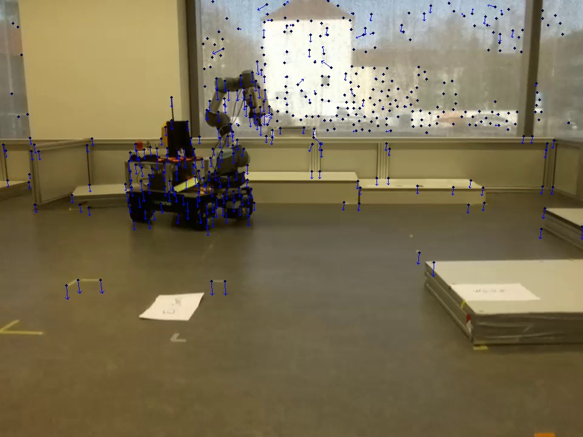
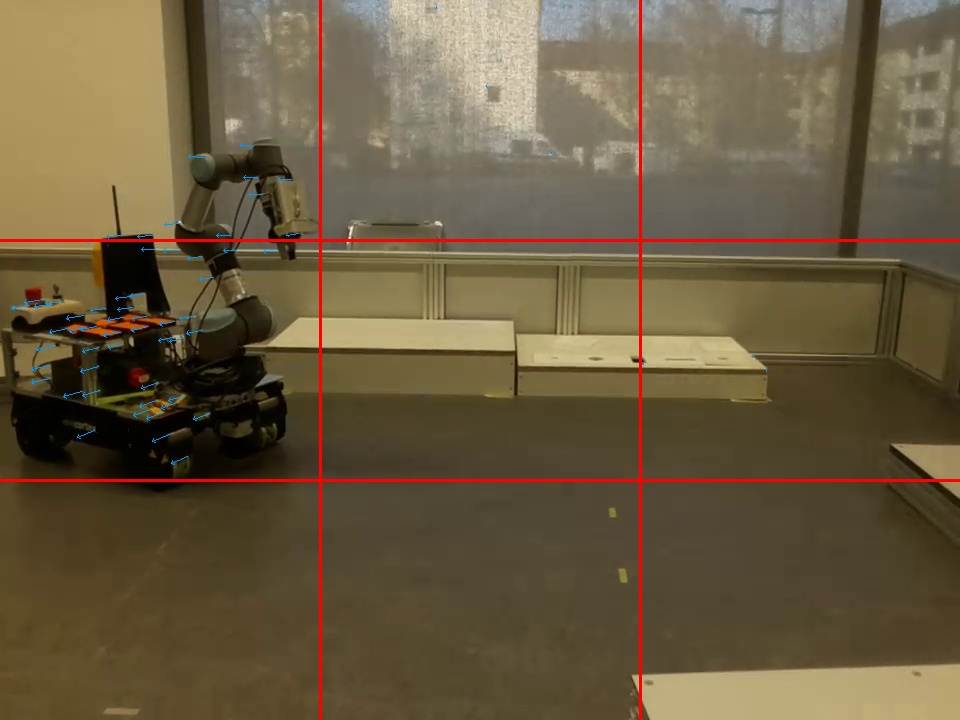

# Optical Flow Calculation using Pyramidal Lucas-Kanade Method

This repository contains an implementation of the Pyramidal Lucas-Kanade optical flow algorithm. It provides a way to estimate the motion of features between two consecutive images using a pyramid of image scales for robust and efficient tracking.

## Features
- Calculates optical flow using the **Pyramidal Lucas-Kanade** method.
- Flexible feature parameters allow adjustments for various applications.
- Supports static or dynamic environments.

## Requirements
- Python 3.x
- OpenCV
- NumPy

## Installation
1. Clone this repository to your local system:
   ```bash
   git clone https://github.com/Yacynte/optical_flow_pyramidal_LK.git
   ```
2. Install the required dependencies using pip:
   ```bash
   pip install -r requirements.txt
   ```
   Make sure your `requirements.txt` contains all the necessary libraries.

## Usage
To calculate the optical flow using the Pyramidal Lucas-Kanade method, you can call the function `lucas_pyramidal`:

```python
lucas_pyramidal(img1_, img2_, number_features, wz, level, k, inlier_threshold, static)
```

### Parameters:
- **img1_**: The first image frame.
- **img2_**: The second image frame.
- **number_features**: The number of features to track between the two frames.
- **wz**: The window size used in the optical flow algorithm.
- **level**: The number of pyramid levels.
- **k**: The number of iterations for each pyramid level.
- **inlier_threshold**: The threshold for considering inliers during feature matching.
- **static**: Boolean indicating the environment type (`True` for static, `False` for dynamic).

### Example Usage
```python
# Example code snippet
import cv2

# Load images
img1_ = 'frame1.png'
img2_ = 'frame2.png'
img1 = cv2.imread(img1_, cv2.IMREAD_GRAYSCALE)
img2 = cv2.imread(img2_, cv2.IMREAD_GRAYSCALE)

# Call the lucas_pyramidal function with relevant parameters
flow = lucas_pyramidal(img1, img2, number_features=100, wz=5, level=5, k=70, inlier_threshold=3, static=True)
```

### Output
The function returns the calculated optical flow for the specified parameters.



## License
MIT License

Copyright (c) [2024] [Batchaya Yacynte]

Permission is hereby granted, free of charge, to any person obtaining a copy of this software and associated documentation files (the "Software"), to deal in the Software without restriction, including without limitation the rights to use, copy, modify, merge, publish and/or distribute copies of the Software, and to permit persons to whom the Software is furnished to do so, subject to the following conditions:

The above copyright notice and this permission notice shall be included in all copies or substantial portions of the Software.

THE SOFTWARE IS PROVIDED "AS IS", WITHOUT WARRANTY OF ANY KIND, EXPRESS OR IMPLIED, INCLUDING BUT NOT LIMITED TO THE WARRANTIES OF MERCHANTABILITY, FITNESS FOR A PARTICULAR PURPOSE AND NONINFRINGEMENT. IN NO EVENT SHALL THE AUTHORS OR COPYRIGHT HOLDERS BE LIABLE FOR ANY CLAIM, DAMAGES OR OTHER LIABILITY, WHETHER IN AN ACTION OF CONTRACT, TORT OR OTHERWISE, ARISING FROM, OUT OF OR IN CONNECTION WITH THE SOFTWARE OR THE USE OR OTHER DEALINGS IN THE SOFTWARE.


## Contributing
Contributions are welcome! Feel free to submit issues or pull requests to improve the implementation.

